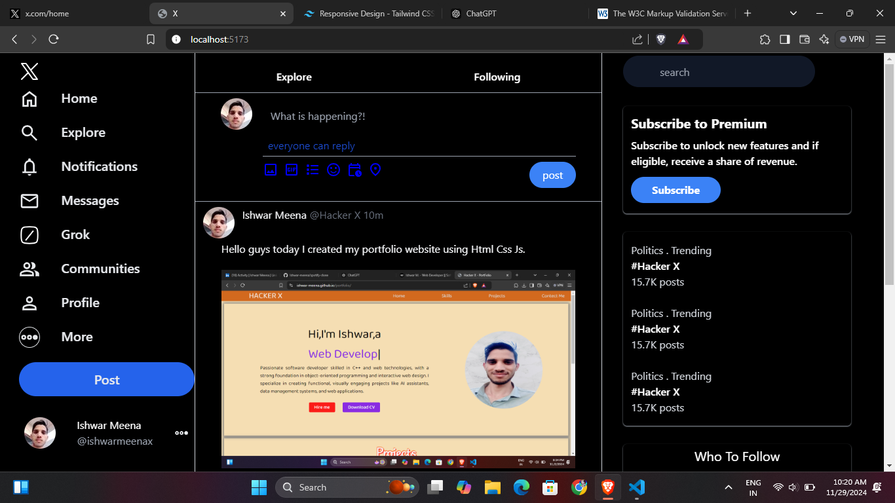
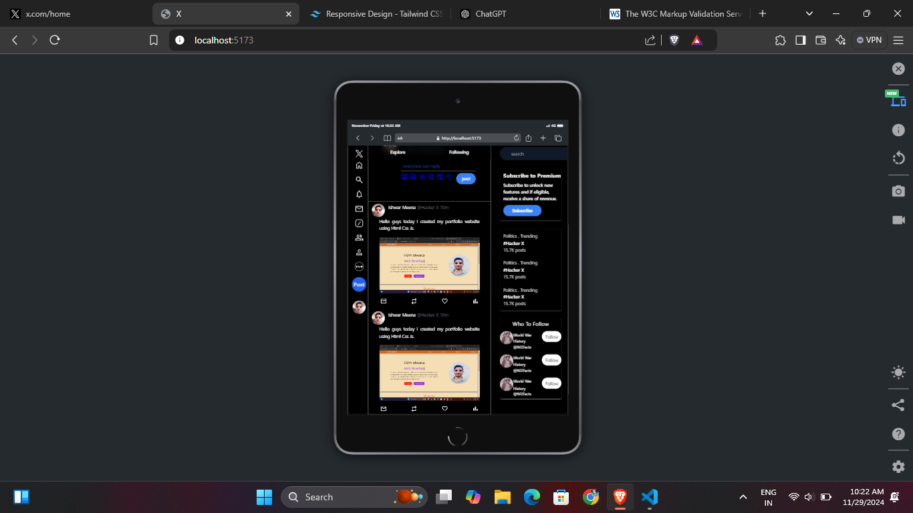
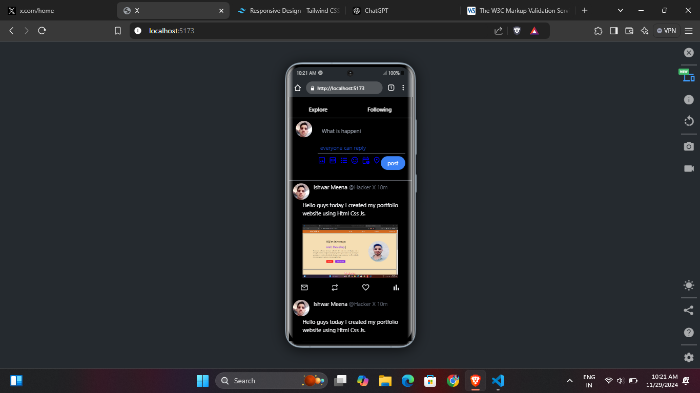

# **X Clone Using Tailwind Css**

An elegant and responsive **X (formerly Twitter)** clone built using **HTML** and **Tailwind CSS**. This project focuses on replicating the design and functionality of X's user interface with placeholder elements for dynamic interactivity.

---

## **📋 Features**

### **1. Responsive Layout**
- Fully responsive design for seamless viewing across desktop, tablet, and mobile devices.
- Tailwind CSS utilities ensure flexibility and optimized scaling.

### **2. Sidebar Navigation**
- A sleek left sidebar with navigation options:
  - **Home**, **Explore**, **Notifications**, **Messages**, **Profile**, **Communities**, and more.
- Hover effects and tooltips for enhanced user interaction.

### **3. Main Feed Section**
- Post creation feature with text input and media upload icons.
- Dynamic feed with placeholder posts showcasing user information, text, and images.

### **4. Right Sidebar**
- **Search bar** for discovering content.
- Trending topics section with hashtags and stats.
- Suggestions for "Who to Follow."

### **5. Sticky Elements**
- Navigation and essential features stay visible while scrolling for better usability.

---

---

## 📸 Screenshots of the App

### 1. Desktop Screen


### 2. Tab Screen


### 3. Mobile Player


---

## **📂 File Structure**

```social-media-dashboard/
├── Assets/
│   ├── logo.svg
│   ├── home.svg
│   ├── search.svg
│   └── ... (other assets)
├── src/
│   ├── input.css
│   ├── output.css
├── index.html
```

---

## **⚙️ Installation**

1. **Clone the Repository**:
   ```bash
   git clone https://github.com/ishwar-meena/X-Clone.git
   cd X-Clone
   ```

---

2. **Install Tailwind CSS (if using a custom build)**:
   ```bash
   npm install
3. **Build Tailwind CSS:**:
   ```bash
   npx tailwindcss -i ./src/input.css -o ./src/output.css --watch
